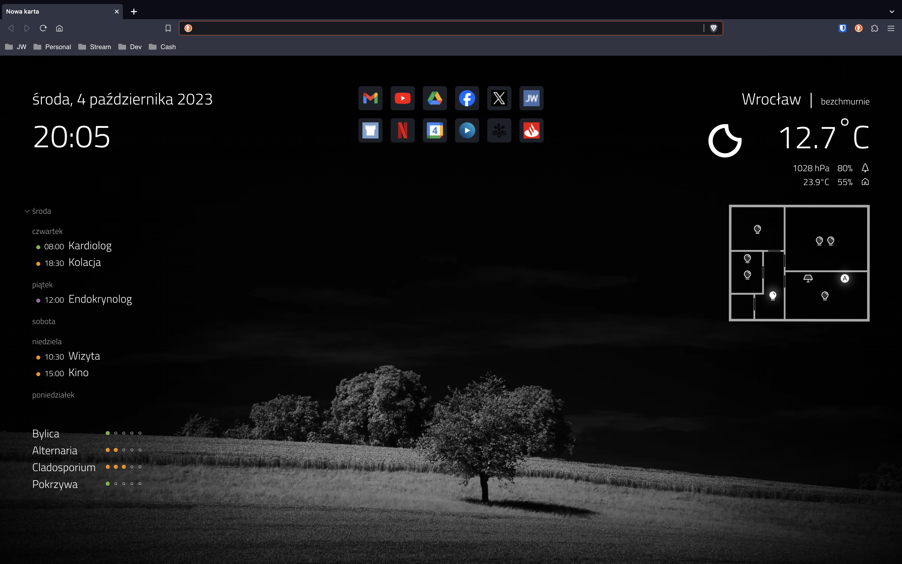

# My new tab Chrome extension

Customized new tab experience tailored for my needs.



## Stack

- TS
- React
- [swr](https://swr.vercel.app/) for data fetching
- [Vite](https://vitejs.dev/) for bundling

## Perquisites 

- Node 16 or higher (to build extension)

## Features

- Display bookmarks bar
- Cool, randomly changing wallpapers from https://unsplash.com/ 
- Display date and time
- Display top visited sites
- Display current weather from https://openweathermap.org/
- Control lights in the flat
- Control Air Purifier
- Display agenda from Google calendars
- Display hourly updated allergens in your area from https://twojapogoda.pl

## Installation

- Clone repo
- Install deps (`npm i`)
- Copy (or rename) `.env.local.template` file to `.env.local`
- Configure features (see below [Configuration](#configuration) section)
- Edit `public/manifest.json` file and change `http://homeassistant.local:8123/` under `permissions` key to the same value as `VITE_HA_URL` in `.env.local` file
- Build app (`npm run build`)
- Go to Chrome (or whatever Chromium based browser, e.g. Brave), open extensions page (`chrome://extensions`), turn on developer mode, click **Load unzipped** and select `build` folder of this app
- Open new tab and enjoy!

## Configuration

### Bookmarks bar
I created this component to replace native bookmarks bar. I want to display bar only in the new tab and not in pages (there is setting for that in browser, but it is broken if you are using custom new tab).

If you do not want additional bookmarks bar, then go to `src/app/App.tsx` and comment out or remove this line:

```jsx
<Bookmarks />
```

### Wallpapers
You can change wallpapers as you wish. Place images in `public/wallpapers` folder and edit `src/app/wallpapersData.json` file. In json file there should be names of the images placed in wallpapers folder.

### Weather
In `.env.local` search for following variable:

```sh
VITE_OPENWEATHER_API_URL="https://api.openweathermap.org/data/2.5/weather?lang=pl&units=metric&&id=YYY&appid=XXX"
```

Set:
- your language (here lang is set to `pl`)
- your city id (replace `YYY` with city id - to get id go [here](https://openweathermap.org/), search for your city and copy id from browser url)
- and most important - obtain api key [here](https://openweathermap.org/api) (you need to create free account) and replace `XXX` with this key

### Lights
This one requires some work. 

You need a floor plan. Create it in `.svg` format (I used for that great free app [Inkscape](https://inkscape.org/)). Then upload/paste it into this web [app](https://jakearchibald.github.io/svgomg/) (it will improve svg file and fix some issues). Put file in `src/features/floorPlan/assets/plan.svg`.

You need to control switches over Internet or local network. I'm using [Home Assistant](https://www.home-assistant.io/) api and smart [Sonoff](https://sonoff.tech/) switches connected to HA via [this integration](https://github.com/AlexxIT/SonoffLAN).

Set following variables in `.env.local`:
- `VITE_HA_URL` - link which you use to open HA in browser (in my case it is `http://homeassistant.local:8123`)
- `VITE_HA_TOKEN` access token to HA ([here](https://developers.home-assistant.io/docs/api/rest/) is info how to obtain token)

Next obtain `entity_id` for all switches and put them in `src/api/hooks.ts` in `useLights` function.

Then go to `src/features/floorPlan/FloorPlan.module.css` and adjust bulbs positions under `lights positions`. It is easier to position it in the browser. Just run this app in [Development](#development) mode, inspect lightbulb and experiment with css.

### Air Purifier
It also uses HA api to control Purifier. I have Xiaomi Mi Air Purifier 3H. It uses this [integration](https://www.home-assistant.io/integrations/xiaomi_miio/).

It needs the same `.env.local` variables as [Lights](#lights) setup.

### Calendar
It also uses [HA integration](https://www.home-assistant.io/integrations/google/) to retrieve data from Google calendar. To see calendar colors you need to modify in **HA** `google_calendars.yaml` file. Add to `device_id` suffix with hex color (like `_ff0000`) (this is some workaround, because HA integration doesn't provide info about calendar color):

```yaml
- cal_id: some_id@group.calendar.google.com
  entities:
  - device_id: some_device_id_ff0000
    ignore_availability: true
    name: "My Calendar"
    track: true
```

### Allergens
This one uses data provider from Poland and might not work in another countries.

Update following variable in `.env.local`:

```sh
VITE_ALLERGENS_API_URL="https://data.twojapogoda.pl/forecasts/themed/allergies/daily/2517/1"
```

You need to find your city id (`2517` is Wrocław). Visit https://www.twojapogoda.pl/ open dev tools, go to network tab. Next use search to find your city and click enter. It will make some requests in network tab. One of them will be number - it is your city id.

## Development

Type `npm start` and dev server will spin up and app will be opened as normal webpage.

To be able to make fetch calls to local home assistant url (`http://homeassistant.local:8123`) you need to add in HA `configuration.yaml` following lines:

```yaml
http:
    cors_allowed_origins:
        - http://localhost:5173
```

Then save and restart HA.

Remember, that some features in dev mode are unavailable, such as most props in `chrome` object. In these cases functionalities are mocked (like top visited sites and favicons).
