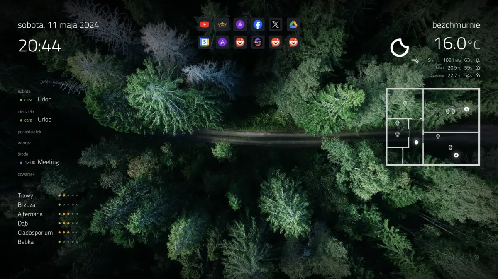
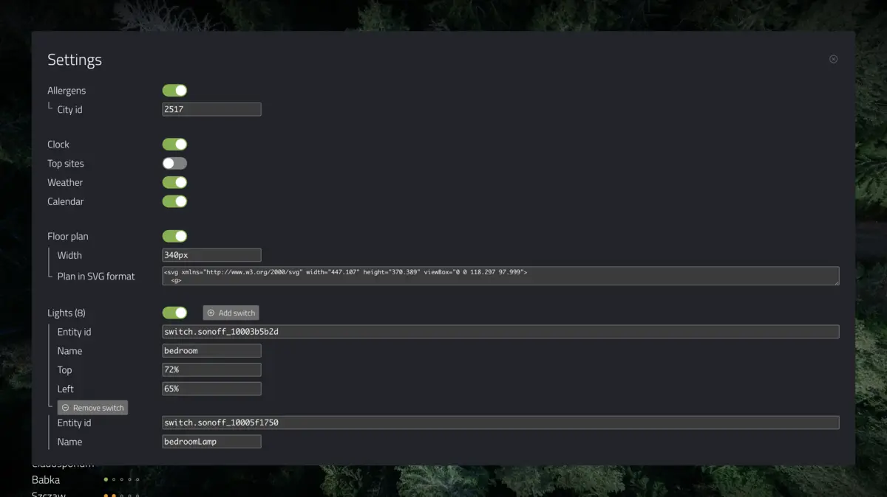

# My new tab Chrome extension

Customized new tab experience tailored for my needs.



## Stack

- TS
- React
- [swr](https://swr.vercel.app/) for data fetching
- [Vite](https://vitejs.dev/) for bundling
- [Zustand](https://docs.pmnd.rs/zustand/getting-started/introduction) for state management

## Perquisites 

- Node 16 or higher (to build extension)

## Features

- Cool, randomly changing wallpapers from https://unsplash.com/ 
- Display date and time
- Display top visited sites
- Display current weather from https://openweathermap.org/
- Control lights in the flat
- Control Air Purifiers
- Display agenda from Google calendars
- Display hourly updated allergens in your area (in Poland) from https://twojapogoda.pl

Most features can be enabled/disabled individually in settings.

## Installation

- Clone repo
- Install deps (`npm i`)
- Build app (`npm run build`)
- Go to Chrome (or whatever Chromium based browser, e.g. Brave), open extensions page (`chrome://extensions`), turn on developer mode, click **Load unzipped** and select `build` folder of this app
- Open new tab and click small, subtle gear icon in right bottom of the new tab page - this will bring up Settings modal dialog, where some configuration needs to be done:



## Configuration

Any change done in Settings page is saved automatically (when changing switch or leaving input field).

### Home Assistant

Some features are connected to [Home Assistant](https://www.home-assistant.io/) and use its api:
- Calendar
- Lights
- Air Purifier
- Weather

To connect to HA set following variables:
- `HA url` - link which you use to open HA in browser (in my case it is `http://homeassistant.local:8123`, but it can be some external url if you have exposed HA to Internet.
- `HA token` access token to HA ([here](https://developers.home-assistant.io/docs/api/rest/) is info how to obtain token)

### Allergens

This one uses data provider from Poland and might not work in another countries.

You need to find your city id (`2517` is Wrocław). Visit https://www.twojapogoda.pl/ open dev tools, go to network tab. Next use search to find your city and click enter. It will make some requests in network tab. One of them will be number - it is your city id.

### Weather

It uses OpenWeatherMap [integration](https://www.home-assistant.io/integrations/openweathermap/) in HA. You also need api key from OpenWeatherMap (get it [here](https://openweathermap.org/api)), which you need to paste into integration config in HA.

### Calendar

It also uses [HA integration](https://www.home-assistant.io/integrations/google/) to retrieve data from Google calendar. To see calendar colors you need to modify in **HA** calendar entities ids. Add to entity id suffix with hex color (like `_ff0000`, so it becomes `calendar.some_cal_ff0000`) (this is some workaround, because HA integration doesn't provide info about calendar color).


### Floor Plan

If you want to control lights or air purifier - you need a floor plan. Create it in `.svg` format (I used for that great free app [Inkscape](https://inkscape.org/)). Then upload/paste it into this web [app](https://jakearchibald.github.io/svgomg/) (it will improve svg file and fix some issues).

Next, open file in some text editor and copy content to `Plan in SVG format` text area field (you need to replace current sample svg).

### Lights

I'm using smart [Sonoff](https://sonoff.tech/) switches connected to HA via [this integration](https://github.com/AlexxIT/SonoffLAN).

Obtain `entity_id` from HA for switch and put it under `Entity id` in Lights section. Add name, which should be unique for every switch. Also adjust there bulbs positions using `Left` and `Top` property (values are percents of floor plan dimensions). It is easier to position it by inspecting lightbulb in browser, open dev tools and experiment with css.

Next, add another light by clicking `Add switch`.

### Air Purifier

It also uses HA api to control Purifier. I have two Xiaomi Mi Air Purifiers: 3H and 4 (and this app was tested only for this models). It uses [xiaomi miio](https://www.home-assistant.io/integrations/xiaomi_miio/) (for 3H) and [xiaomi miot](https://github.com/al-one/hass-xiaomi-miot) (for 4) integration. 

Specify device positions and name like for Lights.

There is also place for `Temperature entity` and `Humidity entity`. If you add it, then these values (retrieved from purifier's sensors) will be displayed under Weather section as additional, indoor values.

## Development

Type `npm start` and dev server will spin up and app will be opened as normal webpage.

To be able to make fetch calls to local home assistant url (`http://homeassistant.local:8123`) you need to add in HA `configuration.yaml` following lines:

```yaml
http:
    cors_allowed_origins:
        - http://localhost:5173
```

Then save and restart HA.

Remember, that most features in dev mode are unavailable including Settings. So it makes dev mode not so useful for now.

If your changes are not just some css changes, then better option would be just build it again (`npm run build`) and refresh new page to see your changes.
